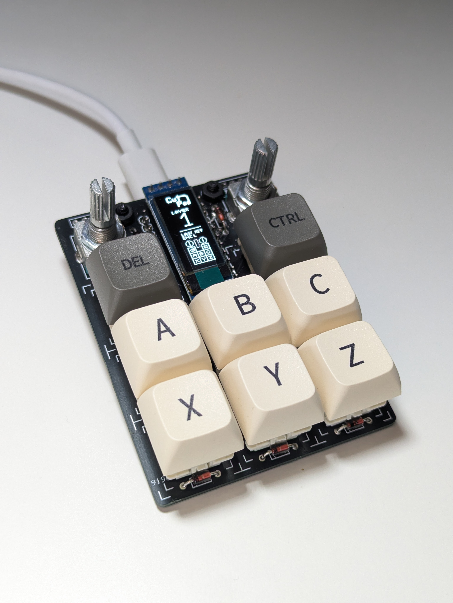
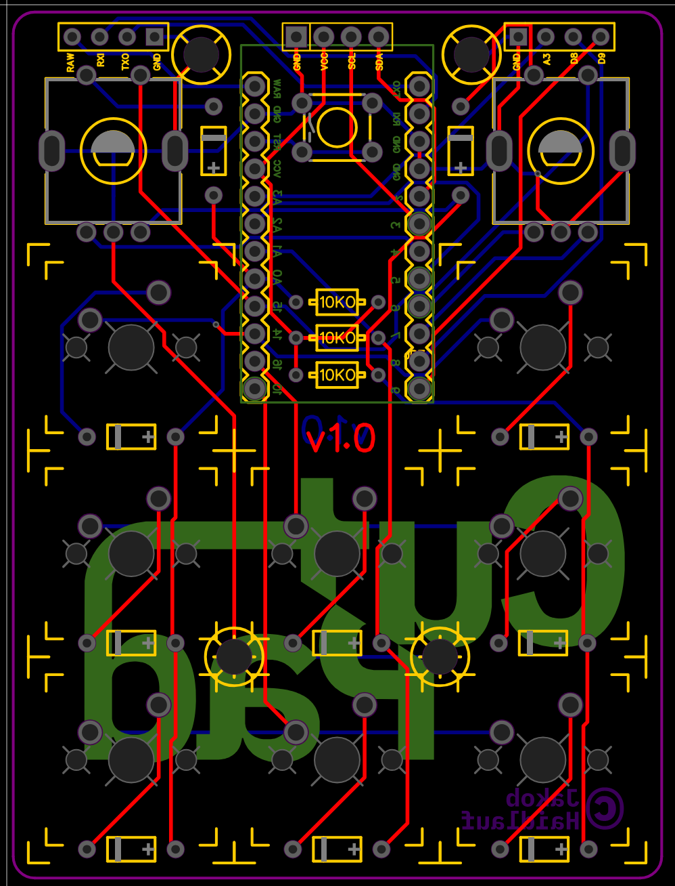

# CutPad - Custom Macro Controller



**Ein minimalistisches 8-Tasten Macro Pad mit Dual-Encodern und OLED-Display - optimiert für effiziente Workflows**

Key Features:
- 6 Layer Unterstützung mit visueller OLED-Anzeige
- Media Controls
- Windows Shortcuts

## Technische Spezifikationen
| Komponente          | Details                                               |
|---------------------|-------------------------------------------------------|
| Controller          | Pro Micro (ATmega32U4)                                |
| Anschluss           | USB-C 2.0                                             |
| Tasten              | 8× MX-Switches + 2× EC11 Encoder mit Drucktasten      |
| Display             | 0.91" I2C OLED (SSD1306, 32×128 Pixel)                |
| PCB Design          | [EasyEDA Projekt](https://easyeda.com)                |
| Herstellung         | [JLCPCB](https://jlcpcb.com) SMT Assembly             |
| Abmessungen         | 60×80×35mm                                            |
| Firmware            | QMK mit Custom OLED-Treiber                           |

## Hardware-Design


- **Kompaktes Layout:** 4×3 Matrix mit intelligentem Routing
- **Encoder-Integration:** EC11 Encoder mit stabiler THT-Montage
- **OLED-Anschluss:** Dedizierte I2C-Pins mit Pull-Up Widerständen
- **Pro Micro Halterung:** Stabiler Sockel-Design für einfachen Austausch

## Software-Architektur
```c
// Encoder-Handler mit Debouncing
bool encoder_update_user(uint8_t index, bool clockwise) {
    if (timer_elapsed(last_encoder_activity) < ENCODER_DEBOUNCE_TIME) return false;
    
    last_encoder_activity = timer_read();
    
    if (index == 0) { // Linker Encoder
        tap_code(clockwise ? KC_VOLD : KC_VOLU);
        encoder_value_L += clockwise ? 1 : -1;
    } else { // Rechter Encoder
        tap_code(clockwise ? KC_LEFT : KC_RGHT);
        encoder_value_R += clockwise ? 1 : -1;
    }
    return false;
}

// Dynamische OLED-Anzeige
bool oled_task_user(void) {
    if (oled_updates > 50) {
        oled_clear();
        layer_display(); // Zeigt aktuellen Layer
        encoder_display(); // Encoder-Zustände
        last_key_display(); // Letzte gedrückte Taste
        oled_updates = 0;
    }
    // ... Animationslogik
    return true;
}
```

## License
Creative Commons Attribution-NonCommercial 4.0 International License

## Copyright
Jakob